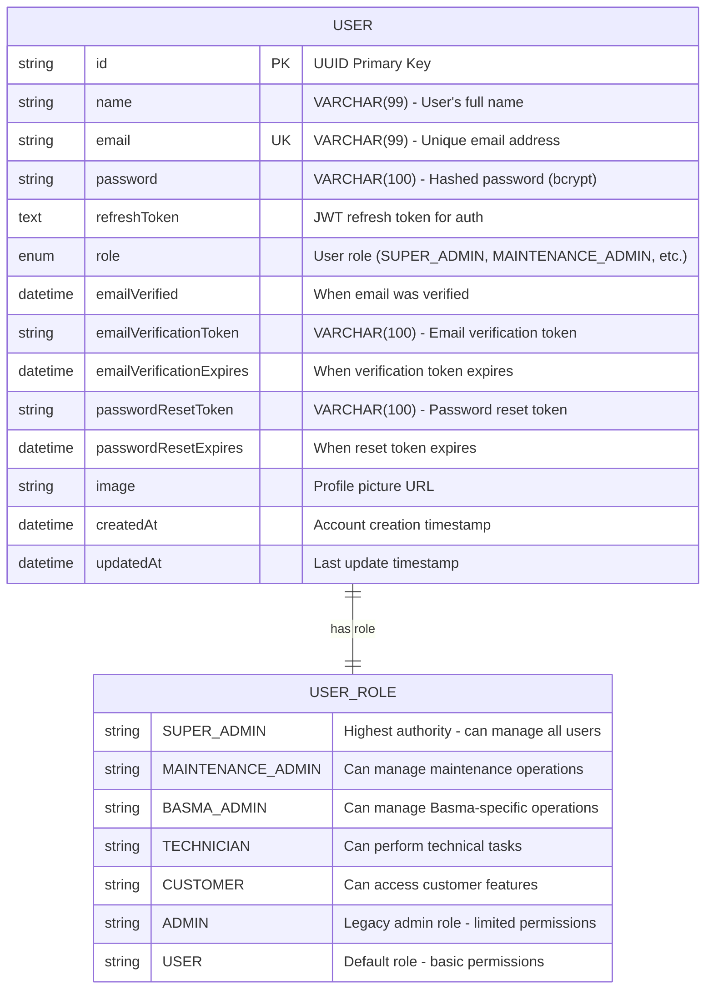

# 🗄️ Database Schema Diagram

## Overview

This diagram shows the complete database structure for the Basma Backend application, including the user table and role hierarchy.

## Database Structure



## Field Descriptions

### 🔑 Primary Key

- **id**: Unique identifier for each user (UUID format)
- **email**: Unique email address for login and communication

### 👤 User Information

- **name**: User's full name (max 99 characters)
- **password**: Securely hashed password using bcrypt
- **image**: Optional profile picture URL

### 🔐 Authentication & Security

- **refreshToken**: JWT token for maintaining user sessions
- **emailVerificationToken**: Token sent for email verification
- **emailVerificationExpires**: Expiration time for verification token
- **passwordResetToken**: Token for password reset functionality
- **passwordResetExpires**: Expiration time for reset token

### 👑 Authorization

- **role**: User's permission level (enum with 7 different roles)
- **emailVerified**: Timestamp when user verified their email

### 📅 Timestamps

- **createdAt**: When the user account was created
- **updatedAt**: When the user account was last modified

## User Roles Explained

| Role                  | Description            | Permissions                                                   |
| --------------------- | ---------------------- | ------------------------------------------------------------- |
| **SUPER_ADMIN**       | Highest authority      | Can manage all users, access system stats, view security logs |
| **MAINTENANCE_ADMIN** | Maintenance operations | Can manage maintenance-related operations                     |
| **BASMA_ADMIN**       | Basma-specific admin   | Can manage Basma-specific operations and data                 |
| **TECHNICIAN**        | Technical staff        | Can perform technical tasks and access technical resources    |
| **CUSTOMER**          | End customer           | Can access customer features and view their own data          |
| **ADMIN**             | Legacy admin           | Can manage users with limited permissions                     |
| **USER**              | Basic user             | Default role with basic permissions                           |

## Database Technology Stack

- **Database**: MySQL
- **ORM**: Prisma
- **Connection**: Environment variable `MYSQL_DATABASE_URL`
- **Migrations**: Prisma migrations in `prisma/migrations/`

## Sample Data Structure

```json
{
  "id": "550e8400-e29b-41d4-a716-446655440000",
  "name": "Marwan Ahmed",
  "email": "marwan@basma.com",
  "password": "$2b$10$hashed_password_here",
  "refreshToken": "eyJhbGciOiJIUzI1NiIsInR5cCI6IkpXVCJ9...",
  "role": "SUPER_ADMIN",
  "emailVerified": "2024-01-15T10:30:00Z",
  "emailVerificationToken": null,
  "emailVerificationExpires": null,
  "passwordResetToken": null,
  "passwordResetExpires": null,
  "image": "https://example.com/avatar.jpg",
  "createdAt": "2024-01-01T00:00:00Z",
  "updatedAt": "2024-01-15T15:30:00Z"
}
```

## Security Features

- ✅ **UUID Primary Keys**: Unpredictable user identifiers
- ✅ **Unique Email Constraint**: Prevents duplicate accounts
- ✅ **Password Hashing**: bcrypt encryption for secure password storage
- ✅ **JWT Tokens**: Secure authentication and session management
- ✅ **Email Verification**: Built-in email verification system
- ✅ **Password Reset**: Secure password reset functionality
- ✅ **Role-Based Access**: Granular permission system
