# 🏗️ System Architecture Diagram

## Overview

This diagram shows the complete system architecture of the Basma Backend, including all layers from client requests to database storage.

## Complete System Architecture

```mermaid
graph TB
    subgraph "🌐 Client Layer"
        WebApp[🖥️ Web Application]
        MobileApp[📱 Mobile App]
        API[🔌 API Clients]
    end

    subgraph "⚖️ Load Balancer Layer"
        LoadBalancer[⚖️ Load Balancer<br/>Distributes traffic]
        RateLimit[🚦 Rate Limiting<br/>Prevents abuse]
    end

    subgraph "🛡️ Security Layer"
        Security[🔒 Security Headers<br/>Helmet.js]
        CORS[🌐 CORS<br/>Cross-origin requests]
        Auth[🔐 Authentication<br/>JWT tokens]
    end

    subgraph "⚙️ Application Layer"
        ExpressApp[🚀 Express.js App<br/>Main application]
        WebSocket[🔌 WebSocket Service<br/>Real-time communication]
        Middleware[🛠️ Middleware Stack<br/>Request processing]
    end

    subgraph "🎮 Controller Layer"
        AuthController[🔐 Auth Controller<br/>Login, signup, verification]
        UserController[👤 User Controller<br/>User management]
        AdminController[👑 Admin Controller<br/>Admin functions]
        MonitorController[📊 Monitor Controller<br/>System monitoring]
    end

    subgraph "⚙️ Service Layer"
        AuthService[🔐 Auth Service<br/>Authentication logic]
        UserService[👤 User Service<br/>User operations]
        EmailService[📧 Email Service<br/>Email notifications]
        WebSocketService[🔌 WebSocket Service<br/>Real-time features]
        ErrorService[🚨 Error Service<br/>Error monitoring]
        MetricsService[📊 Metrics Service<br/>Performance tracking]
    end

    subgraph "🗄️ Data Layer"
        PrismaORM[🔗 Prisma ORM<br/>Type-safe queries]
        MySQL[(🗄️ MySQL Database<br/>User data storage)]
        Cache[⚡ Redis Cache<br/>Performance optimization]
    end

    subgraph "📊 Monitoring Layer"
        Prometheus[📈 Prometheus<br/>Metrics collection]
        Grafana[📊 Grafana<br/>Data visualization]
        Logs[📝 Logging System<br/>Winston logger]
    end

    subgraph "🐳 Infrastructure Layer"
        Docker[🐳 Docker Containers<br/>Application packaging]
        Health[❤️ Health Checks<br/>System status]
    end

    %% Client connections
    WebApp --> LoadBalancer
    MobileApp --> LoadBalancer
    API --> LoadBalancer

    %% Load balancer to security
    LoadBalancer --> RateLimit
    RateLimit --> Security

    %% Security to application
    Security --> CORS
    CORS --> Auth
    Auth --> ExpressApp

    %% Application layer
    ExpressApp --> WebSocket
    ExpressApp --> Middleware

    %% Middleware to controllers
    Middleware --> AuthController
    Middleware --> UserController
    Middleware --> AdminController
    Middleware --> MonitorController

    %% Controllers to services
    AuthController --> AuthService
    UserController --> UserService
    AdminController --> UserService
    MonitorController --> MetricsService

    %% Services to data layer
    AuthService --> EmailService
    AuthService --> PrismaORM
    UserService --> PrismaORM
    MetricsService --> Prometheus

    %% Data layer connections
    PrismaORM --> MySQL
    ExpressApp --> Cache

    %% Monitoring connections
    Prometheus --> Grafana
    ExpressApp --> Logs

    %% Infrastructure
    ExpressApp --> Docker
    ExpressApp --> Health

    %% Styling with high contrast colors
    classDef clientLayer fill:#e3f2fd,stroke:#1976d2,stroke-width:2px,color:#000
    classDef loadBalancer fill:#f3e5f5,stroke:#7b1fa2,stroke-width:2px,color:#000
    classDef security fill:#ffebee,stroke:#c62828,stroke-width:2px,color:#000
    classDef application fill:#e8f5e8,stroke:#388e3c,stroke-width:2px,color:#000
    classDef controller fill:#fff3e0,stroke:#f57c00,stroke-width:2px,color:#000
    classDef service fill:#fce4ec,stroke:#c2185b,stroke-width:2px,color:#000
    classDef data fill:#e0f2f1,stroke:#00695c,stroke-width:2px,color:#000
    classDef monitoring fill:#f1f8e9,stroke:#558b2f,stroke-width:2px,color:#000
    classDef infrastructure fill:#e1f5fe,stroke:#0277bd,stroke-width:2px,color:#000

    class WebApp,MobileApp,API clientLayer
    class LoadBalancer,RateLimit loadBalancer
    class Security,CORS,Auth security
    class ExpressApp,WebSocket,Middleware application
    class AuthController,UserController,AdminController,MonitorController controller
    class AuthService,UserService,EmailService,WebSocketService,ErrorService,MetricsService service
    class PrismaORM,MySQL,Cache data
    class Prometheus,Grafana,Logs monitoring
    class Docker,Health infrastructure
```

## Architecture Layers Explained

### 🌐 Client Layer

- **Web Application**: Browser-based frontend
- **Mobile App**: Mobile application
- **API Clients**: Third-party integrations

### ⚖️ Load Balancer Layer

- **Load Balancer**: Distributes incoming requests across multiple servers
- **Rate Limiting**: Prevents API abuse and ensures fair usage

### 🛡️ Security Layer

- **Security Headers**: Helmet.js provides security headers
- **CORS**: Handles cross-origin resource sharing
- **Authentication**: JWT-based authentication system

### ⚙️ Application Layer

- **Express.js App**: Main Node.js application
- **WebSocket Service**: Real-time communication capabilities
- **Middleware Stack**: Request processing pipeline

### 🎮 Controller Layer

- **Auth Controller**: Handles login, signup, email verification
- **User Controller**: Manages user operations
- **Admin Controller**: Administrative functions
- **Monitor Controller**: System monitoring and health checks

### ⚙️ Service Layer

- **Auth Service**: Authentication business logic
- **User Service**: User management operations
- **Email Service**: Email notifications and templates
- **WebSocket Service**: Real-time features
- **Error Service**: Error monitoring and reporting
- **Metrics Service**: Performance metrics collection

### 🗄️ Data Layer

- **Prisma ORM**: Type-safe database queries
- **MySQL Database**: Primary data storage
- **Redis Cache**: Performance optimization

### 📊 Monitoring Layer

- **Prometheus**: Metrics collection and storage
- **Grafana**: Data visualization and dashboards
- **Logging System**: Winston-based logging

### 🐳 Infrastructure Layer

- **Docker Containers**: Application packaging and deployment
- **Health Checks**: System status monitoring

## Key Features

### 🔒 Security Features

- JWT-based authentication
- Password hashing with bcrypt
- Rate limiting and CORS protection
- Security headers with Helmet.js
- Input validation with Zod

### ⚡ Performance Features

- Redis caching for improved response times
- Compression middleware
- Connection pooling
- Garbage collection monitoring

### 📊 Monitoring Features

- Prometheus metrics collection
- Grafana dashboards
- Health check endpoints
- Error monitoring and alerting
- Request logging and tracing

### 🔄 Real-time Features

- WebSocket support for live updates
- Real-time notifications
- Live system monitoring

## Technology Stack

| Layer                | Technology           | Purpose                   |
| -------------------- | -------------------- | ------------------------- |
| **Runtime**          | Node.js              | JavaScript runtime        |
| **Framework**        | Express.js           | Web application framework |
| **Language**         | TypeScript           | Type-safe JavaScript      |
| **Database**         | MySQL                | Relational database       |
| **ORM**              | Prisma               | Database toolkit          |
| **Cache**            | Redis                | In-memory data store      |
| **Authentication**   | JWT                  | Token-based auth          |
| **Monitoring**       | Prometheus + Grafana | Metrics and visualization |
| **Containerization** | Docker               | Application packaging     |
| **Logging**          | Winston              | Logging library           |

