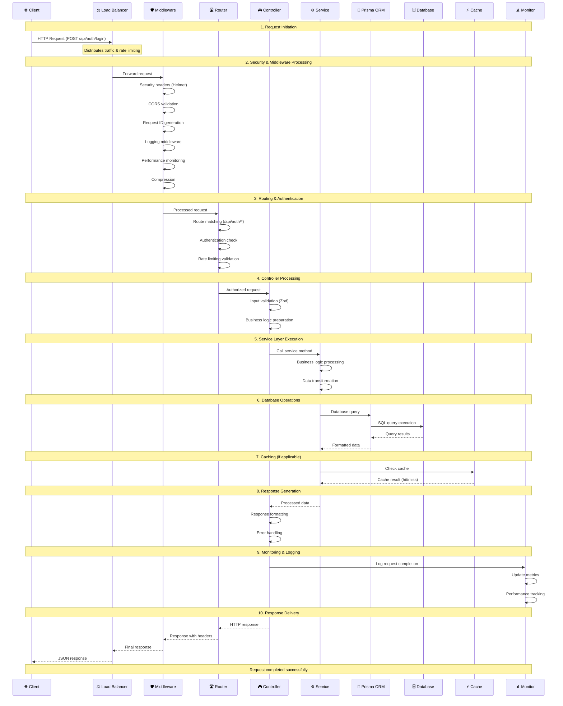
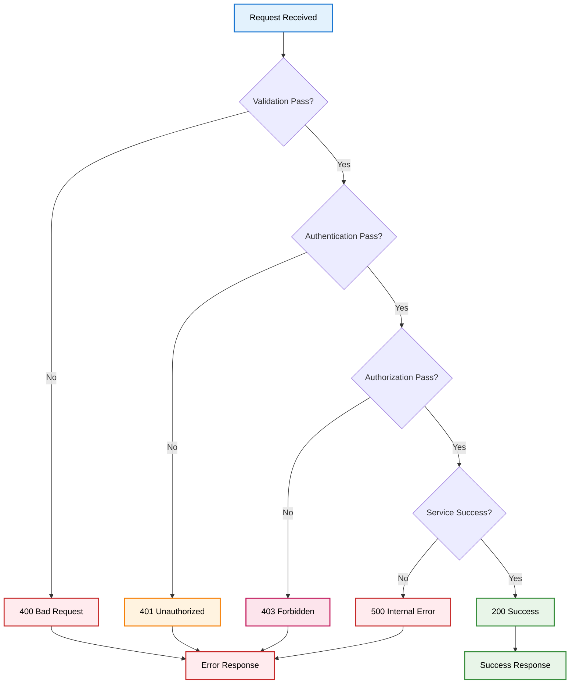

# 🔄 Request Flow Diagram

## Overview

This diagram shows how a typical HTTP request flows through the Basma Backend system, from the client to the database and back.

## Complete Request Flow



## Detailed Flow Breakdown

### 1. 🌐 Request Initiation

- **Client** sends HTTP request (e.g., POST /api/auth/login)
- **Load Balancer** receives and distributes the request
- **Rate Limiting** checks if request is within limits

### 2. 🛡️ Security & Middleware Processing

- **Security Headers**: Helmet.js adds security headers
- **CORS**: Validates cross-origin requests
- **Request ID**: Generates unique request identifier
- **Logging**: Records request details
- **Performance**: Tracks request timing
- **Compression**: Compresses response if needed

### 3. 🛣️ Routing & Authentication

- **Route Matching**: Finds the correct route handler
- **Authentication**: Validates JWT token (if required)
- **Rate Limiting**: Checks endpoint-specific limits
- **Validation**: Validates request parameters

### 4. 🎮 Controller Processing

- **Input Validation**: Zod schema validation
- **Business Logic**: Prepares data for service layer
- **Error Handling**: Catches and formats errors

### 5. ⚙️ Service Layer Execution

- **Business Logic**: Core application logic
- **Data Processing**: Transforms and validates data
- **External Services**: Calls email, WebSocket services

### 6. 🗄️ Database Operations

- **Prisma ORM**: Type-safe database queries
- **MySQL**: Executes SQL queries
- **Connection Pooling**: Manages database connections
- **Transaction Management**: Ensures data consistency

### 7. ⚡ Caching (Optional)

- **Cache Check**: Looks for cached data
- **Cache Update**: Updates cache with new data
- **Performance**: Reduces database load

### 8. 📊 Monitoring & Logging

- **Metrics**: Updates Prometheus metrics
- **Logging**: Records request completion
- **Performance**: Tracks response times
- **Error Tracking**: Monitors for errors

### 9. 🔄 Response Generation

- **Data Formatting**: Structures response data
- **Error Handling**: Formats error responses
- **Status Codes**: Sets appropriate HTTP status

### 10. 📤 Response Delivery

- **Headers**: Adds response headers
- **Compression**: Compresses response if needed
- **Client**: Delivers final response to client

## Request Types & Examples

### 🔐 Authentication Request

```
POST /api/auth/login
{
  "email": "user@example.com",
  "password": "password123"
}
```

### 👤 User Management Request

```
GET /api/users
Authorization: Bearer <jwt-token>
```

### 👑 Admin Request

```
POST /api/super-admin/users
Authorization: Bearer <jwt-token>
{
  "name": "New User",
  "email": "newuser@example.com",
  "role": "TECHNICIAN"
}
```

### 📊 Monitoring Request

```
GET /api/monitoring/health
```

## Error Handling Flow



## Performance Optimizations

### ⚡ Caching Strategy

- **User Data**: Cached for 5 minutes
- **System Stats**: Cached for 1 minute
- **Health Checks**: No caching (real-time)

### 🔄 Connection Pooling

- **Database**: Prisma connection pooling
- **Redis**: Connection reuse
- **HTTP**: Keep-alive connections

### 📊 Monitoring Points

- **Request Duration**: Track response times
- **Error Rates**: Monitor failure rates
- **Memory Usage**: Track memory consumption
- **Database Queries**: Monitor query performance

## Security Checkpoints

1. **Rate Limiting**: Prevents abuse
2. **CORS**: Validates origins
3. **Authentication**: JWT token validation
4. **Authorization**: Role-based access control
5. **Input Validation**: Zod schema validation
6. **SQL Injection**: Prisma ORM protection
7. **XSS Protection**: Input sanitization
8. **CSRF Protection**: Token validation
