# 🔐 Authentication Flow Diagram

## Overview

This diagram shows the complete authentication flow in the Basma Backend system, including login, token management, and authorization processes.

## Complete Authentication Flow

```mermaid
sequenceDiagram
    participant User as 👤 User
    participant Client as 🌐 Client App
    participant API as 🚀 API Server
    participant Auth as 🔐 Auth Service
    participant DB as 🗄️ Database
    participant Email as 📧 Email Service
    participant JWT as 🎫 JWT Service

    Note over User,JWT: 1. User Registration Flow
    User->>Client: Enter registration details
    Client->>API: POST /api/auth/signup
    API->>Auth: Validate registration data
    Auth->>DB: Check if email exists
    DB-->>Auth: Email availability
    Auth->>Auth: Hash password (bcrypt)
    Auth->>DB: Create user account
    DB-->>Auth: User created
    Auth->>Email: Send verification email
    Email-->>User: Verification email sent
    Auth-->>API: Registration successful
    API-->>Client: 201 Created
    Client-->>User: "Check your email for verification"

    Note over User,JWT: 2. Email Verification Flow
    User->>Email: Click verification link
    Email->>API: GET /api/auth/verify-email?token=xxx
    API->>Auth: Validate verification token
    Auth->>DB: Update emailVerified status
    DB-->>Auth: Email verified
    Auth-->>API: Verification successful
    API-->>Client: 200 OK
    Client-->>User: "Email verified successfully"

    Note over User,JWT: 3. User Login Flow
    User->>Client: Enter email & password
    Client->>API: POST /api/auth/login
    API->>Auth: Validate login credentials
    Auth->>DB: Find user by email
    DB-->>Auth: User data
    Auth->>Auth: Verify password (bcrypt)
    Auth->>JWT: Generate access token
    JWT-->>Auth: Access token
    Auth->>JWT: Generate refresh token
    JWT-->>Auth: Refresh token
    Auth->>DB: Store refresh token
    DB-->>Auth: Token stored
    Auth-->>API: Login successful + tokens
    API-->>Client: 200 OK + tokens
    Client->>Client: Store tokens securely
    Client-->>User: "Login successful"

    Note over User,JWT: 4. Authenticated Request Flow
    User->>Client: Make API request
    Client->>API: GET /api/users (with Bearer token)
    API->>Auth: Validate JWT token
    Auth->>JWT: Verify token signature
    JWT-->>Auth: Token valid
    Auth->>DB: Get user from token
    DB-->>Auth: User data
    Auth->>Auth: Check user permissions
    Auth-->>API: User authenticated & authorized
    API->>API: Process request
    API-->>Client: 200 OK + data
    Client-->>User: Display data

    Note over User,JWT: 5. Token Refresh Flow
    Client->>API: Request with expired token
    API->>Auth: Token expired
    Auth-->>API: 401 Unauthorized
    Client->>API: POST /api/auth/refresh (with refresh token)
    API->>Auth: Validate refresh token
    Auth->>DB: Check refresh token
    DB-->>Auth: Token valid
    Auth->>JWT: Generate new access token
    JWT-->>Auth: New access token
    Auth->>DB: Update refresh token
    DB-->>Auth: Token updated
    Auth-->>API: New tokens
    API-->>Client: 200 OK + new tokens
    Client->>Client: Update stored tokens
    Client->>API: Retry original request
    API-->>Client: 200 OK + data

    Note over User,JWT: 6. Password Reset Flow
    User->>Client: Request password reset
    Client->>API: POST /api/auth/forgot-password
    API->>Auth: Validate email
    Auth->>DB: Find user by email
    DB-->>Auth: User found
    Auth->>Auth: Generate reset token
    Auth->>DB: Store reset token + expiry
    DB-->>Auth: Token stored
    Auth->>Email: Send reset email
    Email-->>User: Reset email sent
    Auth-->>API: Reset email sent
    API-->>Client: 200 OK
    Client-->>User: "Check your email for reset link"

    User->>Email: Click reset link
    Email->>API: GET /api/auth/reset-password?token=xxx
    API->>Auth: Validate reset token
    Auth->>DB: Check token validity
    DB-->>Auth: Token valid
    Auth-->>API: Token valid
    API-->>Client: 200 OK (show reset form)
    Client-->>User: "Enter new password"

    User->>Client: Enter new password
    Client->>API: POST /api/auth/reset-password
    API->>Auth: Validate new password
    Auth->>Auth: Hash new password
    Auth->>DB: Update password + clear tokens
    DB-->>Auth: Password updated
    Auth-->>API: Password reset successful
    API-->>Client: 200 OK
    Client-->>User: "Password reset successful"

    Note over User,JWT: 7. Logout Flow
    User->>Client: Logout
    Client->>API: POST /api/auth/logout
    API->>Auth: Invalidate tokens
    Auth->>DB: Remove refresh token
    DB-->>Auth: Token removed
    Auth-->>API: Logout successful
    API-->>Client: 200 OK
    Client->>Client: Clear stored tokens
    Client-->>User: "Logged out successfully"
```



## Authentication Components

### 🔐 JWT Token Structure

```mermaid
graph LR
    subgraph "🎫 JWT Token Components"
        Header[📋 Header<br/>Algorithm & Type]
        Payload[📦 Payload<br/>User Data & Claims]
        Signature[✍️ Signature<br/>Verification]
    end

    subgraph "📦 Payload Contents"
        UserID[🆔 User ID]
        Email[📧 Email]
        Role[👑 Role]
        Expiry[⏰ Expiry Time]
        Issued[📅 Issued At]
    end

    Header --> Payload
    Payload --> Signature
    Payload --> UserID
    Payload --> Email
    Payload --> Role
    Payload --> Expiry
    Payload --> Issued

    style Header fill:#e3f2fd,stroke:#1976d2,stroke-width:2px,color:#000
    style Payload fill:#f3e5f5,stroke:#7b1fa2,stroke-width:2px,color:#000
    style Signature fill:#e8f5e8,stroke:#388e3c,stroke-width:2px,color:#000
    style UserID fill:#fff3e0,stroke:#f57c00,stroke-width:2px,color:#000
    style Email fill:#fce4ec,stroke:#c2185b,stroke-width:2px,color:#000
    style Role fill:#e0f2f1,stroke:#00695c,stroke-width:2px,color:#000
    style Expiry fill:#f1f8e9,stroke:#558b2f,stroke-width:2px,color:#000
    style Issued fill:#e1f5fe,stroke:#0277bd,stroke-width:2px,color:#000
```



### 🛡️ Security Measures

```mermaid
graph TD
    subgraph "🔒 Password Security"
        A[User Password] --> B[bcrypt Hashing]
        B --> C[Salt Generation]
        C --> D[Stored Hash]
    end

    subgraph "🎫 Token Security"
        E[JWT Secret] --> F[Token Generation]
        F --> G[Signature Verification]
        G --> H[Token Validation]
    end

    subgraph "📧 Email Security"
        I[Email Verification] --> J[Token Expiry]
        J --> K[One-time Use]
        K --> L[Secure Links]
    end

    subgraph "🔄 Session Security"
        M[Refresh Tokens] --> N[Token Rotation]
        N --> O[Secure Storage]
        O --> P[Automatic Expiry]
    end

    style A fill:#ffebee,stroke:#c62828,stroke-width:2px,color:#000
    style B fill:#e8f5e8,stroke:#388e3c,stroke-width:2px,color:#000
    style C fill:#fff3e0,stroke:#f57c00,stroke-width:2px,color:#000
    style D fill:#f3e5f5,stroke:#7b1fa2,stroke-width:2px,color:#000
    style E fill:#e3f2fd,stroke:#1976d2,stroke-width:2px,color:#000
    style F fill:#fce4ec,stroke:#c2185b,stroke-width:2px,color:#000
    style G fill:#e0f2f1,stroke:#00695c,stroke-width:2px,color:#000
    style H fill:#f1f8e9,stroke:#558b2f,stroke-width:2px,color:#000
```



## Authentication Endpoints

### 🔐 Authentication Routes

| Endpoint                        | Method | Description            | Auth Required |
| ------------------------------- | ------ | ---------------------- | ------------- |
| `/api/auth/signup`              | POST   | User registration      | ❌ No         |
| `/api/auth/login`               | POST   | User login             | ❌ No         |
| `/api/auth/logout`              | POST   | User logout            | ✅ Yes        |
| `/api/auth/verify-email`        | GET    | Email verification     | ❌ No         |
| `/api/auth/resend-verification` | POST   | Resend verification    | ❌ No         |
| `/api/auth/forgot-password`     | POST   | Password reset request | ❌ No         |
| `/api/auth/reset-password`      | POST   | Password reset         | ❌ No         |
| `/api/auth/refresh`             | POST   | Token refresh          | ✅ Yes        |

### 📊 Response Examples

#### ✅ Successful Login Response

```json
{
  "success": true,
  "message": "Login successful",
  "data": {
    "accessToken": "eyJhbGciOiJIUzI1NiIsInR5cCI6IkpXVCJ9...",
    "refreshToken": "eyJhbGciOiJIUzI1NiIsInR5cCI6IkpXVCJ9...",
    "user": {
      "id": "550e8400-e29b-41d4-a716-446655440000",
      "name": "Marwan Ahmed",
      "email": "marwan@basma.com",
      "role": "SUPER_ADMIN",
      "emailVerified": "2024-01-15T10:30:00Z"
    }
  }
}
```

#### ❌ Failed Login Response

```json
{
  "success": false,
  "message": "Invalid credentials",
  "error": {
    "code": "INVALID_CREDENTIALS",
    "details": "Email or password is incorrect"
  }
}
```

#### 🔄 Token Refresh Response

```json
{
  "success": true,
  "message": "Token refreshed successfully",
  "data": {
    "accessToken": "eyJhbGciOiJIUzI1NiIsInR5cCI6IkpXVCJ9...",
    "refreshToken": "eyJhbGciOiJIUzI1NiIsInR5cCI6IkpXVCJ9..."
  }
}
```

## Security Best Practices

### 🔒 Password Security

- **bcrypt hashing** with salt rounds
- **Minimum 8 characters** required
- **Password complexity** validation
- **Secure password reset** flow

### 🎫 Token Security

- **JWT tokens** with secure signatures
- **Short-lived access tokens** (15 minutes)
- **Long-lived refresh tokens** (7 days)
- **Token rotation** on refresh

### 📧 Email Security

- **Email verification** required
- **Secure reset tokens** with expiry
- **One-time use** tokens
- **Rate limiting** on email sending

### 🛡️ Session Security

- **Secure token storage** on client
- **Automatic token refresh**
- **Logout on token expiry**
- **Session invalidation** on logout

## Error Handling

### 🚨 Common Authentication Errors

| Error Code             | HTTP Status | Description                | Solution              |
| ---------------------- | ----------- | -------------------------- | --------------------- |
| `INVALID_CREDENTIALS`  | 401         | Wrong email/password       | Check credentials     |
| `EMAIL_NOT_VERIFIED`   | 403         | Email not verified         | Verify email first    |
| `TOKEN_EXPIRED`        | 401         | Access token expired       | Refresh token         |
| `INVALID_TOKEN`        | 401         | Invalid or malformed token | Re-authenticate       |
| `EMAIL_ALREADY_EXISTS` | 409         | Email already registered   | Use different email   |
| `WEAK_PASSWORD`        | 400         | Password too weak          | Use stronger password |
| `RATE_LIMIT_EXCEEDED`  | 429         | Too many requests          | Wait and retry        |

### 🔄 Error Recovery Flow


